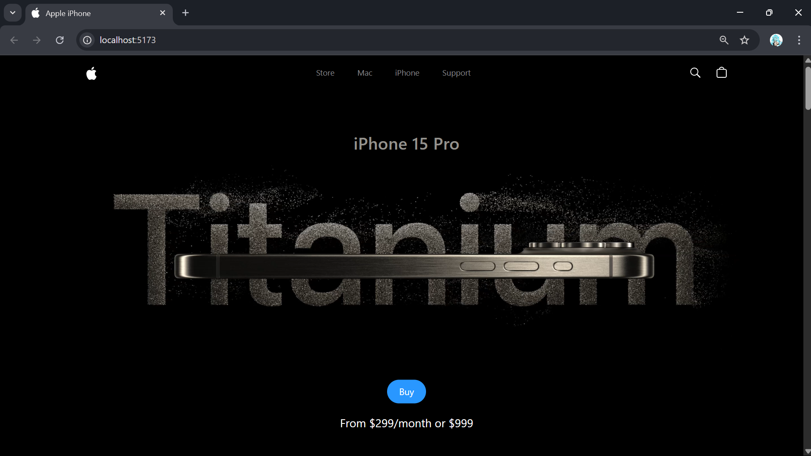
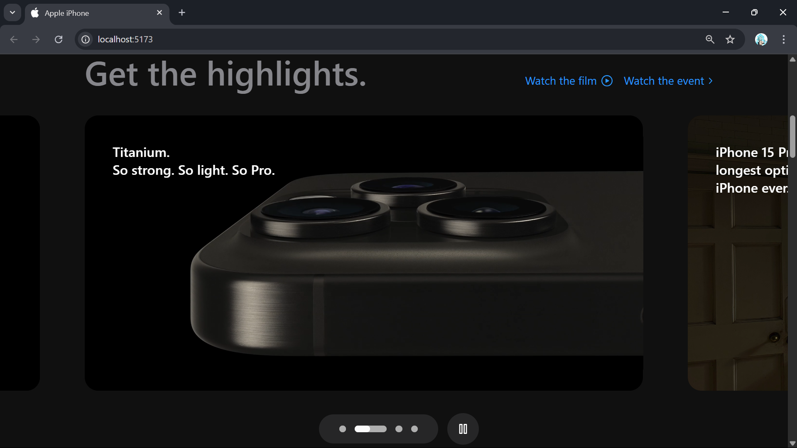
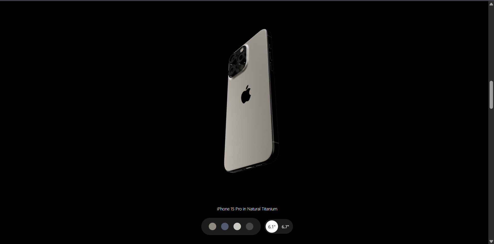
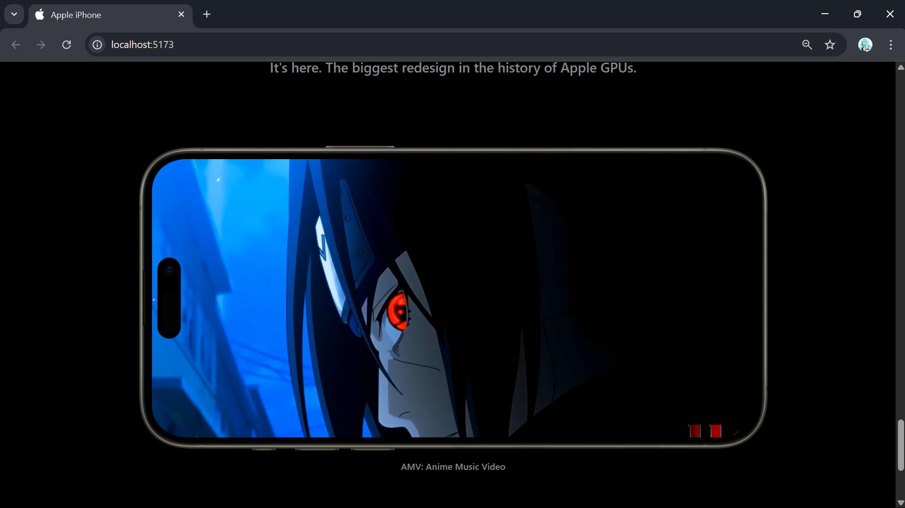

# 🍏 3D iPhone Landing Page — Scroll-Driven Product Reveal

A cinematic landing page experience crafted with **Three.js**, **GSAP**, and **ReactJS**, showcasing a sleek 3D iPhone model in a futuristic, interactive layout. Built to impress — pixel by pixel.

---

## 🌟 Highlights

🔹 **Custom 3D iPhone Experience**
Crafted using Three.js & React Three Fiber — drag, scroll, and explore the phone from every angle.

🔹 **Scroll-Based Motion Design**
GSAP-powered animations that bring life to every scroll. Timelines, triggers, and buttery transitions.

🔹 **Fully Responsive Layout**
Tailwind CSS ensures smooth responsiveness on all screens, from mobile to ultra-wide monitors.

🔹 **Performance First**
Optimized asset loading, lightweight model rendering, and GPU-friendly interactions.

🔹 **Product-First Focus**
Minimal UI. Maximum impact. Designed to highlight the 3D iPhone with style and purpose.

---

## 🧰 Tech Stack

| Layer     | Tools/Frameworks                    |
| --------- | ----------------------------------- |
| Frontend  | ReactJS, Tailwind CSS               |
| 3D Engine | Three.js, React Three Fiber         |
| Animation | GSAP (GreenSock Animation Platform) |

---

## 🔗 Try It Out

* 🎥 **Live Preview:** [Watch Demo](https://your-live-demo-link.com)

---

## 📸 Visual Sneak Peek

| Scene                | Preview                             |
| -------------------- | ----------------------------------- |
| 📱 Hero Section      |      |
| 🎞️ Scroll Animation |  |
| 🧊 3D Model Focus    |       |
| 🦶 Footer & CTA      |  |

---

## 💬 Let's Connect

Have feedback, want to collaborate, or just want to geek out about 3D websites?
Reach out via [LinkedIn](https://www.linkedin.com/in/your-profile/) or shoot a mail at `your.email@example.com`.

